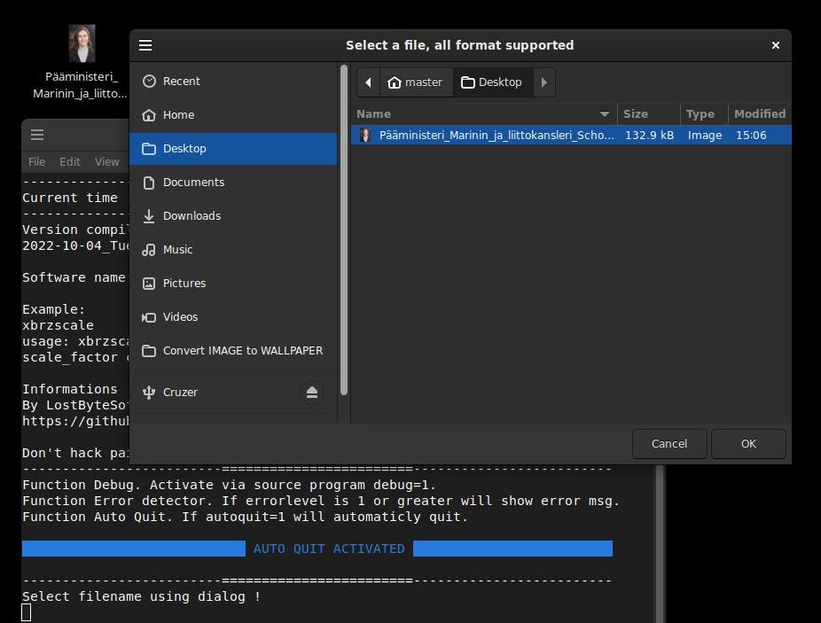
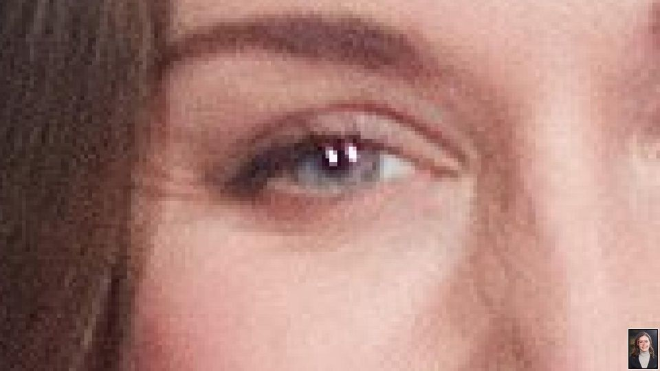
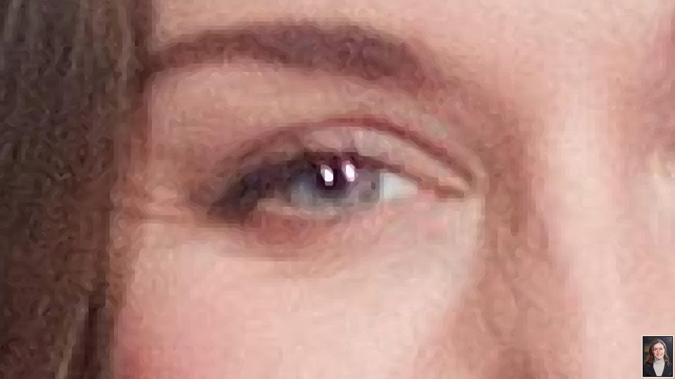

LostByteSoft ; Convert IMAGE to WALLPAPER

Convert images for wallpaper for different resolutions.

Features:
---------------------------------------------

Convert IMAGE to WALLPAPER_v2 the V 2 is the version to use.

	Tested on : ImageMagick 6.9.11-60 Q16 x86_64
	
	Need GNU parallel to work.
	No more black bar.
	
	!!! Convert IMAGE to WALLPAPER_v2.sh is the best to use. !!!
	
	Create centered image, create RESOLUTION images files for wallpaper.
	
	Bash, imagemagick and parallel are used.
	
	NO MORE BLACK BARS in your wallpaper.
	
	Don't hack paid software, free software exists and does the job better.

How to ?
---------------------------------------------

-Make it executable.

-Double click on it, select your file and press enter.

-Files names are pretty revellant to what a files does.

	
Convert image to wallpaper:
---------------------------------------------

	Convert IMAGE to WALLPAPER_v1.sh
		-You select one file and convert to common screen resolutions.
		
	THE BEST TO USE
	Convert IMAGE to WALLPAPER_v2.sh
		-You select one file and convert to multiples resolutions.
		-Convert only to your screen resolution.
		-Convert to any resolution to fill (or remove) all the black bars.
		
	Convert IMAGE to WALLPAPER_v3 (parallel).sh
		-Convert the selected folder AND sub folder.
		-Use parallel to faster convert.

Convert ALL files:
---------------------------------------------

	Convert ALL to JPG (1500x1500).sh
		Convert images files in folder to JPG format + 1500px.

	Convert ALL to PNG.sh
		Convert images files in folder to PNG format.
		
	Convert ALL to WEBP.sh
		Convert images files in folder to WEBP format.
	
	Convert ALL to WEBP (1500x1500).sh
		Convert images files in folder to WEBP format + 1500px.

	Convert ALL to WEBP (parallel).sh
		Convert images files in folder to WEBP format.

		
Convert ONE files:
---------------------------------------------
		
	Convert to JPG.sh
		Convert one images file to JPG format.
		
	Convert to WEBP.sh
		Convert one images file to WEBP format.
		
Image Upscaler files:
---------------------------------------------

	Upscale ONE FILE image xbrzscale.sh
		Upscale one file you specify.
	
	Upscale ALL FOLDER image xbrzscale.sh
		Upscale all files in folder you specified.
	
	Upscale ALL PARALLEL image xbrzscale.sh
		Same as 'all folder' but with gnu parallel.
		Faster

Screen of Upscale ONE FILE image xbrzscale.sh

Original image file.

Upscaled image file.

Others files:
---------------------------------------------

	Creator CoverFolderName.sh
		Create files for music cover album or movie poster folder
		Convert ONE image file to 1000 x 1000 px, poster.jpg
		Convert ONE image file to 750 x 750 px, nameofthefolder.jpg
		Convert ONE image file to 500 x 500 px, cover.jpg

---------------------------------------------

Convert IMAGE to WALLPAPER_v2.sh and select image.

Convert IMAGE to WALLPAPER_v3_(parallel).sh and multiple conversions.

Convert ALL to WEBP (parallel).sh and multiple core conversions.

	Policy to change to the file :
	sudo gedit /etc/ImageMagick-6/policy.xml

	Tested on : ImageMagick 6.9.11-60 Q16 x86_64
	
	sudo gedit /etc/ImageMagick-6/policy.xml
	
	convert -list resource
	
	ImgMack policy are SO LOW you need to change them to something usable
	ex: mem 12GiB , disk 64GiB

---------------------------------------------

	JUST DO WHAT YOU WANT WITH THE PUBLIC LICENSE

	Version 3.1415926532 (January 2022)

	TERMS AND CONDITIONS FOR COPYING, DISTRIBUTION AND MODIFICATION
   
	Everyone is permitted to copy and distribute verbatim or modified copies of
	this license document.

	As is customary and in compliance with current global and interplanetary
	regulations, the author of these pages disclaims all liability for the
	consequences of the advice given here, in particular in the event of partial
	or total destruction of the material, Loss of rights to the manufacturer
	warranty, electrocution, drowning, divorce, civil war, the effects of radiation
	due to atomic fission, unexpected tax recalls or encounters with
	extraterrestrial beings elsewhere.

	LostByteSoft no copyright or copyleft we are in the center.

--------------------------------------------------------------------
# --- End of file ---

